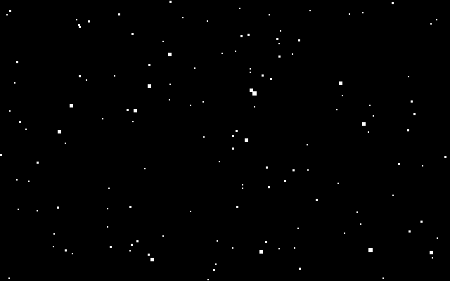
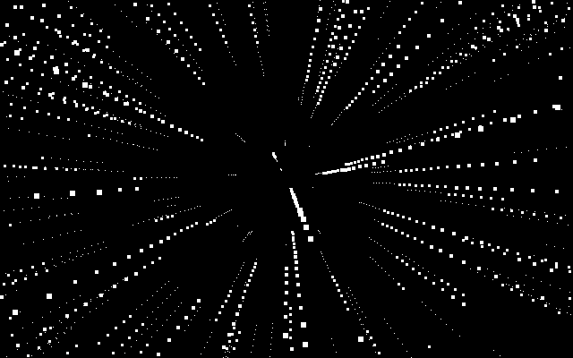

# Starfield Simulation for macOS

A faithful port of the Windows 2000 "Starfield Simulation" screen saver
(`ssstars.scr`, 5.00.2195.6601) to modern macOS.



Not a lookalike. The algorithm was recovered by disassembling the original
binary, and the port reproduces its integer math exactly — the same projection
scale, the same truncating divides, the same 1–5 pixel square stars, the same
speed ramp, and the same linear congruential generator that the Visual C++
runtime used for `rand()`.

Overlay successive frames and the perspective divide shows itself:



Both images above are generated by the actual simulation code (`Tools/main.swift`),
not drawn by hand, so they cannot drift away from what the saver does.

## Install

```sh
./build.sh
cp -R build/Starfield.saver ~/Library/"Screen Savers"/
```

Then choose **Starfield** in System Settings → Screen Saver. Requires macOS 14
or later on Apple Silicon.

## Build

Apple's Command Line Tools are enough — there is no Xcode project, no package
manifest, and no dependencies.

```sh
./build.sh                       # Starfield.saver + a standalone preview app
./build/StarfieldPreview 120 8   # watch it in a window: density, warp speed
```

`build.sh` drives `swiftc` and `clang` directly. A `.saver` must be a Mach-O
bundle, which `swiftc` will not emit, so the sources are compiled to a single
object with `-wmo` and linked with `clang -bundle`. The result is ad-hoc signed;
macOS will not load it otherwise.

## Settings

The original's two options, under their original names:

| Setting | Range | Default |
|---|---|---|
| `Density` | 10–200 stars | 25 |
| `WarpSpeed` | 0–10 | 5 |

Click **Options** in System Settings, or pass them to `StarfieldPreview`.

## Documentation

The interesting part of this repository is the write-up. In reading order:

| | |
|---|---|
| [`WIN32-PRIMER.md`](WIN32-PRIMER.md) | How the original works, and how Win32 works. Assumes no Windows background. |
| [`TEARDOWN.md`](TEARDOWN.md) | How the binary was disassembled — the tools, the order, and two wrong turns. |
| [`HOW-IT-WORKS.md`](HOW-IT-WORKS.md) | How the Swift port works. Assumes no Swift, AppKit, or Objective-C. |
| [`NOTES.md`](NOTES.md) | Bare reference: every recovered constant with the address it came from. |

Short version of what was found: the original's entire graphics vocabulary is
three GDI calls — `GetClipBox`, `PatBlt`, `GetStockObject`. No `SetPixel`, no
`LineTo`. The stars were never dots; they are filled rectangles, which is why
this port draws hard-edged squares with antialiasing switched off.

Project state, open decisions, and what is still unverified:
[`HANDOFF.md`](HANDOFF.md).

## Differences from the original

Four, all deliberate and all recorded in [`NOTES.md`](NOTES.md):

1. **Star sizes scale with screen width.** The original's 1–5 pixels assumed a
   640-pixel CRT. Set `starScale` to `1.0` in `StarfieldView.swift` for
   pixel-exact output.
2. **Frames are redrawn in full** rather than erase-rect-then-draw-rect.
   Visually identical, minus one artifact: overlapping stars no longer punch
   black holes in each other.
3. **The random seed comes from the clock**, not the C runtime's fixed `1`, so
   two launches do not draw the same sky.
4. **Multiple displays behave differently**, and neither side chooses it. The
   original measures the combined virtual desktop and spans all monitors with
   one center point; macOS creates a separate view per screen, so each display
   gets its own starfield.

The simulation itself — constants, integer math, clamps, the placement of the
speed ramp inside the per-star loop — matches the original.

## A note on the original binary

`bin/ssstars.scr` is not included in this repository. It is Microsoft's, and
nothing here needs it: the port builds and runs from source alone, and
`NOTES.md` is the durable record of what it contained. If you want to check
the disassembly yourself, supply your own copy from a Windows 2000 `system32`.

The Swift code in this repository is original work.
