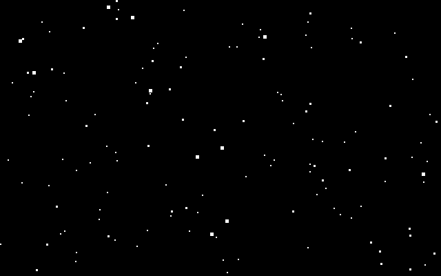
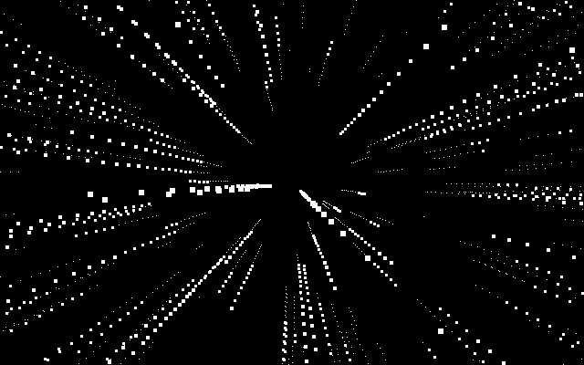

# Starfield Simulation for macOS

[](https://github.com/ilirium/starfield_simulation_screensaver_win2k_for_macos/actions/workflows/ci.yml)

A faithful port of the Windows 2000 "Starfield Simulation" screen saver
(`ssstars.scr`, 5.00.2195.6601) to modern macOS.



Not a lookalike. The algorithm was recovered by disassembling the original
binary, and the port reproduces its integer math exactly — the same projection
scale, the same truncating divides, the same 1–5 pixel square stars, the same
speed ramp, and the same linear congruential generator that the Visual C++
runtime used for `rand()`.

Overlay successive frames and the perspective divide shows itself:



Both images above are generated by the actual simulation code
(`Tools/Render/main.swift`), not drawn by hand, and CI regenerates them on every
push and fails if they differ — so they cannot drift away from what the saver
does.

## Install

Requires **macOS 13 or later, on Apple Silicon**. Built and run on macOS 26; 13
through 15 are what the binary targets rather than what it has been tested on.
Intel Macs are not supported — the build is arm64-only, and a screen saver is a
plugin loaded into the system's host process, so Rosetta cannot bridge the gap.

### From a release

Download the zip from [Releases][releases], unzip it, then pick one:

**Double-click `Starfield.saver`.** macOS offers to install it and opens System
Settings at the Screen Saver pane. Easiest, and the only route with no terminal.

**Install it by hand.** More steps, but it is obvious what it does, and it
sidesteps the Gatekeeper prompt below:

```sh
xattr -dr com.apple.quarantine Starfield.saver
cp -R Starfield.saver ~/Library/"Screen Savers"/
```

Then choose **Starfield** in System Settings → Screen Saver.

[releases]: https://github.com/ilirium/starfield_simulation_screensaver_win2k_for_macos/releases

### If macOS refuses to open it

Released builds are **ad-hoc signed, not notarized** — notarization needs a
paid Apple Developer account, which this project does not have. macOS
quarantines anything downloaded from the internet and is strict about
quarantined code it cannot trace to a registered developer, so it may refuse to
load the saver.

Clearing the quarantine flag is the reliable fix, and is what the manual
install above does up front:

```sh
xattr -dr com.apple.quarantine ~/Library/"Screen Savers"/Starfield.saver
```

If you would rather not use the terminal, open **System Settings → Privacy &
Security**, scroll to Security, and use **Open Anyway** after the first blocked
attempt.

### From source

The route that avoids the question entirely — a bundle you built yourself is
never quarantined. Apple's Command Line Tools are the only requirement:

```sh
./build.sh
cp -R build/Starfield.saver ~/Library/"Screen Savers"/
```

## Build

Apple's Command Line Tools are enough — there is no Xcode project, no package
manifest, and no dependencies.

```sh
./build.sh                       # Starfield.saver + a standalone preview app
./build/StarfieldPreview 120 8   # watch it in a window: density, warp speed
```

`build.sh` drives `swiftc` and `clang` directly. A `.saver` must be a Mach-O
bundle, which `swiftc` will not emit, so the sources are compiled to a single
object with `-wmo` and linked with `clang -bundle`. The result is ad-hoc signed;
macOS will not load it otherwise.

## Settings

The original's two options, under their original names:

| Setting | Range | Default |
|---|---|---|
| `Density` | 10–200 stars | 25 |
| `WarpSpeed` | 0–10 | 5 |

Click **Options** in System Settings, or pass them to `StarfieldPreview`.

## Documentation

The interesting part of this repository is the write-up. In reading order:

| | |
|---|---|
| [`WIN32-PRIMER.md`](docs/WIN32-PRIMER.md) | How the original works, and how Win32 works. Assumes no Windows background. |
| [`TEARDOWN.md`](docs/TEARDOWN.md) | How the binary was disassembled — the tools, the order, and two wrong turns. |
| [`HOW-IT-WORKS.md`](docs/HOW-IT-WORKS.md) | How the Swift port works. Assumes no Swift, AppKit, or Objective-C. |
| [`NOTES.md`](docs/NOTES.md) | Bare reference: every recovered constant with the address it came from. |

Short version of what was found: the original's entire graphics vocabulary is
three GDI calls — `GetClipBox`, `PatBlt`, `GetStockObject`. No `SetPixel`, no
`LineTo`. The stars were never dots; they are filled rectangles, which is why
this port draws hard-edged squares with antialiasing switched off.

Project state, open decisions, and what is still unverified:
[`HANDOFF.md`](HANDOFF.md).

## Differences from the original

Four, all deliberate and all recorded in [`NOTES.md`](docs/NOTES.md):

1. **Star sizes scale with screen width.** The original's 1–5 pixels assumed a
   640-pixel CRT. Set `starScale` to `1.0` in `StarfieldView.swift` for
   pixel-exact output.
2. **Frames are redrawn in full** rather than erase-rect-then-draw-rect.
   Visually identical, minus one artifact: overlapping stars no longer punch
   black holes in each other.
3. **The random seed comes from the clock**, not the C runtime's fixed `1`, so
   two launches do not draw the same sky.
4. **Multiple displays behave differently**, and neither side chooses it. The
   original measures the combined virtual desktop and spans all monitors with
   one center point; macOS creates a separate view per screen, so each display
   gets its own starfield.

The simulation itself — constants, integer math, clamps, the placement of the
speed ramp inside the per-star loop — matches the original.

## A note on the original binary

`bin/ssstars.scr` is not included in this repository. It is Microsoft's, and
nothing here needs it: the port builds and runs from source alone, and
`docs/NOTES.md` is the durable record of what it contained. If you want to check
the disassembly yourself, supply your own copy from a Windows 2000 `system32`.

## License and scope

The port is MIT licensed — see [`LICENSE`](LICENSE). That covers the original
work here: the Swift sources, the build script, the tools, and the
documentation.

It does not extend to `ssstars.scr`, which is Microsoft's. None of that binary
is redistributed: it is gitignored, absent from every commit, and nothing in
the build reads it. What `docs/` contains is a description of observed
behavior — constants, arithmetic, and the addresses they were read from —
written to explain and reproduce the simulation rather than to reconstitute the
program.
